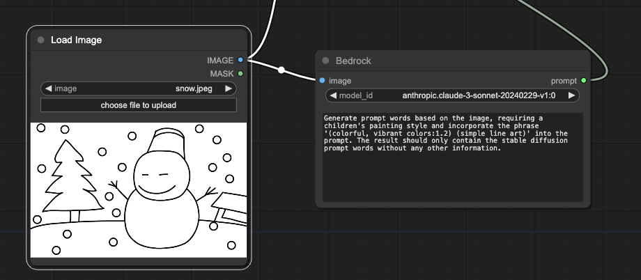

# ComfyUI Bedrock Tagger

## Installation

1. git clone `https://github.com/Menfre01/ComfyUI-Bedrock-Node.git` into `custom_nodes` folder.
2. copy `.env.example` to `.env` and fill in the required fields.
3. `pip install -r requirements.txt`.
4. search Bedrock.

## Usage

